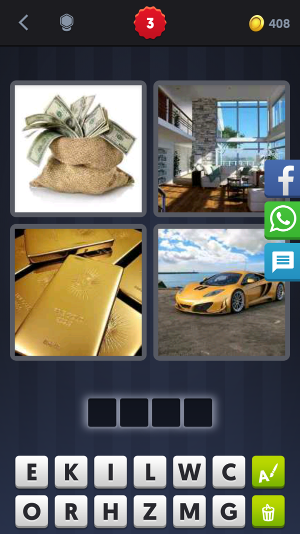
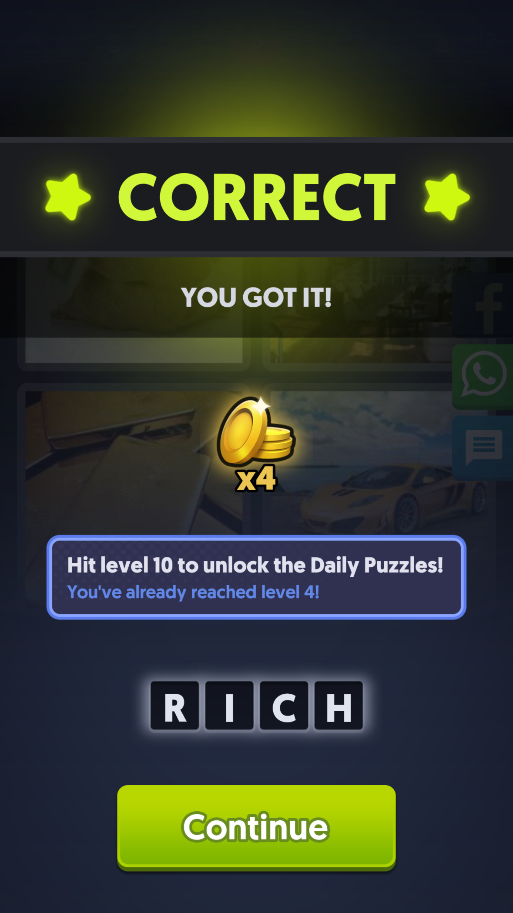
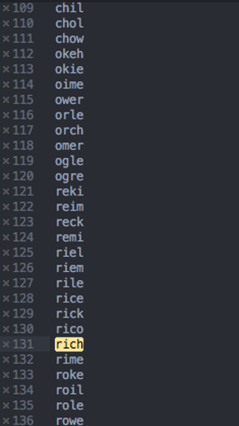

# 4 Pics 1 Word Solver

Puzzle                     |  Solved                  | results.txt
:-------------------------:|:------------------------:|:--------------------
  |   | 

#### Case study
My goal was to have a script/application that would help me solving the "4 Pics 1 Word" puzzle.
To do so we need to automate the proccess of logical thinking that would solve this puzzle.
The cognitive proccess is:
- Write down the words that would describe the images.
- Get the permutations that can be made from the letters we can choose from.
- Match the words from our wordlist (words that match the discribtion of the images) and the results from our permutations that have a length of 4 letters.
- Finally we end up with some results that would possibly match the answer.

#### Steps that have to be made
For every cognitive proccess we would write a method that would fullfilled it's purpose.
So we would have a method: analyze_images, permutation and match_results.
- The analyze_images method would return a list of words that would describe the images.
- The permutation method would get the permutation from the letters we can choose from, it also have to return only the permutation with a length of 4 letters.
- Finally the match_results method match the results from analyze_images and permutation. If there is no match we could match the permutation results with a list of english words e.g. a "dictionary.txt".

#### Analyze the problem
First we need an API that can analyze the images e.g. [Google's cloud vision](https://cloud.google.com/vision) api or the [Clarifai's image and video recognition](https://clarifai.com/) api. The success of our script/application mostly depends on how good our api can recognize the images.
Basically we're by trying to determine possible results by trying hundreds or sometimes thousend of likely possibilities. This technique is known as a [dictionary attack](https://en.wikipedia.org/wiki/Dictionary_attack).

Besides that we make a permutation of an array of letters and filter out the results that does not match the lenght of 4. If we want to make this modular by adding more letters to our array it will results to possible thousends of permutations. All those permutations we have to match with our wordlist or dictionary. This can be time consuming. To make optimal use of our resources we should choose a language that handles this well e.g. a C language or Go.

To allow the actual "attack" to be executed faster we first try to match our permutations with the wordlist that has been generated with our image recognition api. If that fails we can check the permutations with a dictionary that contains a list of 4 letter words.

#### Writing a prototype (POC)
Before we build the actual application first we write a prototype that would proof that our idea we want to build is feasible. The prototype does not include any interaction with an api or so whatever. Also we do not have to think about to make it modular or do some error handling. These things will come later. I choose Ruby because it's easy to write readable code that is capable to do almost everything with only a few lines of code.

#### Testing
After I wrote my prototype I did some testing. All of them (10 out of 10) were positive what results to an outcome of max 250 words where 1 of them was correct. If we found a match using the wordlist instead of matching the permutations with a dictionary the results where much more lower (around 10 max). Even the fact the results contains a max of 250 words it was not hard to find the answer, as most of the results probabilty was very low. For example: rime and
roke would have a low probabilty while rich would have a high probabilty.

#### Room for improvements
Like I mention before, to narrow the outcome we should filter out the words with a lower probabilty. This is only the case when we don't find any match in our wordlist.

### Resources
- [Permutation of 4 letters](https://www.quora.com/How-many-permutations-of-4-letters-can-be-made-out-of-the-letters-of-the-word-examination)
- [Find all the possible permutations using Ruby and recursion](https://stackoverflow.com/questions/25224321/find-all-the-possible-permutations-using-ruby-and-recursion)
- [Dictionary attack](https://en.wikipedia.org/wiki/Dictionary_attack)