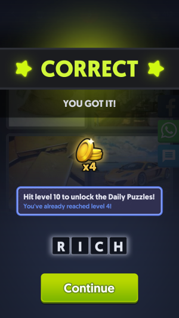

# Bruteforce

Bruteforce solution for 4 Images 1 Word

Puzzle | Solved | results.txt
:-------------------------:|:-------------------------:|:--------------------
 |  | 

### Sources
- [Permitation of 4 letters](https://www.quora.com/How-many-permutations-of-4-letters-can-be-made-out-of-the-letters-of-the-word-exam)
- [Find all possible permutations with Ruby and recursion](https://stackoverflow.com/questions/25224321/find-all-the-possible-permutations-using-ruby-and-recursion)
- [Dictionary attack](https://en.wikipedia.org/wiki/Dictionary_attack)
